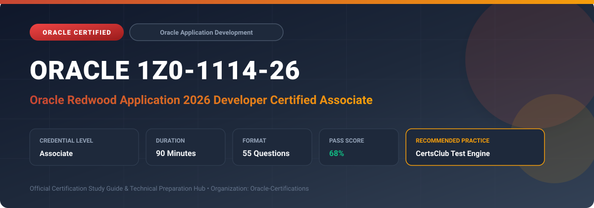

  

# Oracle 1Z0-1114-26: Oracle Redwood Application 2026 Developer Certified Associate

---

## 1. Exam Overview & Candidate Profile

The **Oracle 1Z0-1114-26: Oracle Redwood Application 2026 Developer Certified Associate** exam validates front-end application developers extending and tailoring Oracle Fusion Applications using the modern Redwood design system.

Candidates demonstrate hands-on competence in Oracle Visual Builder Studio (VB Studio), Redwood templates, page patterns, components, business rules, Express Mode, and App UI extensions.

### Target Audience & Prerequisites
- **Target Roles**: Implementation Specialists, Cloud Architects, Technical Leads, Enterprise Consultants, and Systems Engineers.
- **Recommended Experience**: 1–2 years of practical, hands-on experience designing, implementing, and maintaining corresponding Oracle solutions.
- **Credential Earned**: Associate Certification.

---

## 2. Key Exam Specifications

| Specification | Details |
| :--- | :--- |
| **Exam Code** | **Oracle 1Z0-1114-26** |
| **Official Title** | Oracle Redwood Application 2026 Developer Certified Associate |
| **Certification Track** | Oracle Application Development |
| **Exam Duration** | 90 Minutes |
| **Number of Questions** | 55 Questions |
| **Passing Score** | 68% |
| **Question Format** | Multiple Choice (Single/Multiple Answer), Scenario-Based Questions |
| **Delivery Provider** | Oracle University / Pearson VUE (Online Proctored or Test Center) |
| **Recommended Practice Engine** | [CertsClub Oracle Practice Tests](https://www.certsclub.com/oracle/1z0-1114-26-dumps.html) |

---

## 3. Official Blueprint & Exam Domain Breakdown

The examination assesses candidate competencies across core functional domains weighted as follows:

| Domain Area | Weighting |
| :--- | :--- |
| **Redwood UX Design Principles & Component Architecture** | `25%` |
| **Oracle Visual Builder Studio (VB Studio) Workspace Setup** | `25%` |
| **Creating & Customizing App UIs with Redwood Templates** | `20%` |
| **Business Rules, Field Configuration & Dynamic Layouts** | `15%` |
| **Event Listeners, Action Chains & REST Service Integration** | `15%` |

---

## 4. Deep Dive into Complex & Challenging Technical Topics

To secure a passing score on the 1Z0-1114-26 exam, candidates must master the following advanced concepts:

- Navigating Visual Builder Studio to develop App UI extensions for Fusion ERP, HCM, and SCM.
- Utilizing standard Redwood templates: Welcome Page, Foldout Layout, Search & Select, and Overview Page.
- Implementing Business Rules to conditionally show, hide, make read-only, or require specific UI fields.
- Configuring event listeners, custom action chains, and JavaScript functions in VB Studio.
- Binding UI components to Oracle Fusion Applications REST APIs and SDP (Service Data Providers).

---

## 5. Scenario-Based Demo & Practice Questions

### Question 1
In Oracle Visual Builder Studio, what mechanism enables developers to configure field properties (such as visibility, required state, and read-only) dynamically based on user roles or record conditions?

A) Business Rules in Dynamic Layouts
B) CSS Class Overrides
C) SQL Triggers
D) Data Security Policies

- **Correct Answer**: `A) Business Rules in Dynamic Layouts`  
- **Technical Explanation**: Business Rules in VB Studio dynamic layouts allow developers to control field properties (mandatory, hidden, read-only) dynamically using conditional rule expressions.

---

### Question 2
Which Redwood template layout provides a persistent master list on the left with expandable contextual details unfolding on the right?

A) Foldout Layout
B) Welcome Page Layout
C) Modal Dialog Layout
D) Simple Tabular Grid

- **Correct Answer**: `A) Foldout Layout`  
- **Technical Explanation**: The Redwood Foldout Layout pattern provides a hierarchical side-by-side or foldout structure where parent record context is maintained while details unfold.

---

## 6. Recommended Preparation Strategy & Practice Testing Engine

Achieving certification in **Oracle 1Z0-1114-26** requires balanced theoretical study and scenario-based simulation practice:

1. **Review Oracle Documentation**: Master architecture guides, implementation workbooks, and administration manuals on the Oracle Help Center.
2. **Hands-on Lab Practice**: Execute real-world configuration, policy setup, and troubleshooting tasks in your cloud tenancy or test instance.
3. **Simulated Exam Drills**: Practice answering timed, scenario-based multiple-choice questions to familiarize yourself with the question formats, traps, and timing constraints.

### Practice With CertsClub
For realistic practice questions, updated dumps, and mock testing environments:
- **Resource**: [CertsClub Oracle Practice Test Engine](https://www.certsclub.com/oracle/1z0-1114-26-dumps.html)
- **Special Discount**: Use coupon code **`club20`** during checkout for an instant **20% discount** on all practice exam bundles and testing engines.

---

## 7. Official Documentation & References

- [Oracle University Certification Registry](https://education.oracle.com/)
- [Oracle Help Center Documentation Portal](https://docs.oracle.com/)
- [Oracle Cloud Infrastructure & Applications Guides](https://docs.oracle.com/en/cloud/)
- [CertsClub Oracle Certification Exam Practice](https://www.certsclub.com/oracle/1z0-1114-26-dumps.html)

---

## 8. SEO & Discovery Keywords

`oracle 1z0-1114-26, oracle 1z0-1114-26 exam, oracle 1z0-1114-26 dumps, 1Z0-1114-26 practice questions, 1Z0-1114-26 study guide, oracle redwood application 2026 developer certified associate, certsclub 1z0-1114-26`